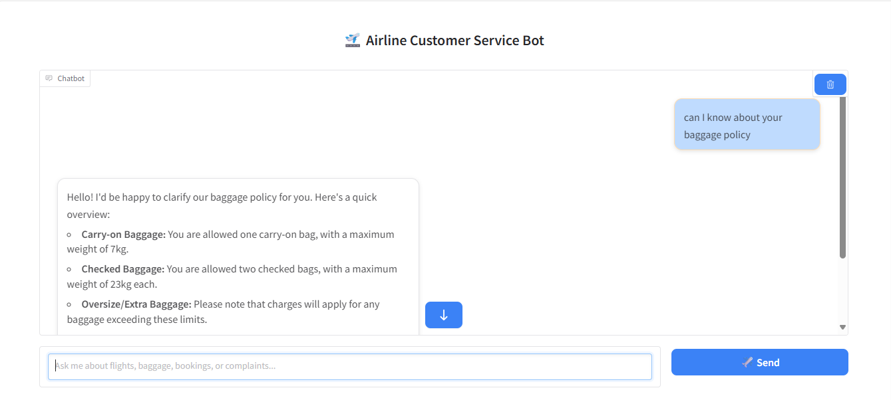

# ✈️ Airline Customer Service Bot

The **Airline Customer Service Bot** is a smart virtual assistant designed to help airline passengers get quick answers to common queries about flights, baggage, bookings, and complaints. It uses **LangChain's RouterChain** to classify user intents and route them to appropriate response templates powered by **Gemini**. The chatbot runs on a clean **Gradio-based UI**, and includes conversation memory for a more natural, context-aware experience.  
This bot can be customized to any type of **customer support domain**, such as railways, hotels, banks, or e-commerce platforms, by simply modifying the intent classification logic and prompt templates—making it a flexible and scalable solution for intelligent, domain-specific virtual assistants.
 

---

## 🔧 What It Does

- 🔍 **Classifies user queries** into 4 main airline intents:
  - **Flight Status**  
  - **Baggage Policy**
  - **Booking Assistance**
  - **Complaints**

- 🧠 **Maintains conversation memory** across turns to support follow-up questions

- 🛠️ **Uses Gemini via LangChain** for LLM-based intent handling and response generation

- 🖥️ **Web UI built with Gradio**, styled with an airline-blue theme

---

## 💡 Technologies Used

- **LangChain**: Chain management, routing logic, prompt templating
- **Gemini (Google Generative AI)**: LLM to generate helpful answers
- **Gradio**: Interactive chat interface for the bot
- **Python**: Core application logic


---

## 📁 Key Features

| Feature                | Description                                                   |
|------------------------|---------------------------------------------------------------|
| ✈️ Intent Routing        | Routes user input to correct logic chain                     |
| 🧠 Memory Support       | Stores conversation turns for context                         |
| 🧾 Custom Prompts       | Each intent has a tailor-made prompt template                 |
| 💬 Gradio UI            | Chat interface with blue theme and bubble messages            |
| 🔐 Secure API Handling  | Uses `dotenv` to manage Gemini API key securely               |

---


## 🚀 How to Run the Airline Customer Service Bot

### 1. Clone the repository

```bash
git clone https://github.com/Lakshani09DL/airlinebot
cd backend
```
### 2. Create and Activate Virtual Environment
```bash
python -m venv venv
# Activate it:
# On Windows:
venv\Scripts\activate
# On macOS/Linux:
source venv/bin/activate
```
### 3. Install Dependencies
```bash
pip install -r requirements.txt
```

### 4. Setup your Gemini API key
Create a .env file in the root directory and add your Gemini key:

```bash
GOOGLE_API_KEY=your-gemini-api-key-here
```
### 5. Run the Chatbot
```bash
python app.py
```
It will launch in your browser at:
👉 http://localhost:7860

## 📸 UI Preview



---

## 🛣️ Future Plans

- Add **WhatsApp/Twilio** integration
- Enable **live flight tracking** with external APIs
- Add **multilingual support** (Sinhala, Tamil)
- Support **ticket escalation** or logging complaint reports


